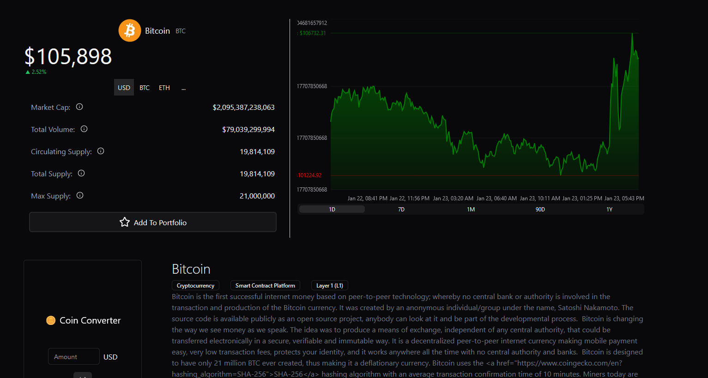

# Nebula Exchange 💰

🚀 [See This Project on my Website](https://www.anindustries.pl/projects/NebulaExchange)

## Introduction 📈

A cutting-edge cryptocurrency exchange platform built to handle real-time trading and forecasting. The platform integrates advanced machine learning models to analyze market data and predict price trends, providing users with actionable insights.

## Key Features 🔑

- **Real-Time Data Processing**: The platform employs real-time data pipelines, optimized using redis to process and analyze cryptocurrency market data efficiently, ensuring up-to-date information for traders.
- **Machine Learning Integration**: A custom-built PyTorch model enables predictive analytics, allowing the platform to anticipate market movements and provide recommendations.
- **User-Friendly**: An intuitive interface that caters to both novices and pros.

## Tech used 🛠️

  

## Screenshots 🖼️

<table align="center">
  <tr>
    <td>
      
      
Coins list

    </td>
    <td>
      
      
User's portfolio

    </td>
  </tr>
  <tr>
    <td>
      
      
Crypto Page

    </td>
    <td>
      
      
AI Model

    </td>
  </tr>
</table>

## Author 💚
[Artur Niemiec](https://anindustries.pl/) - ([@MrNtex](https://www.github.com/MrNtex))
